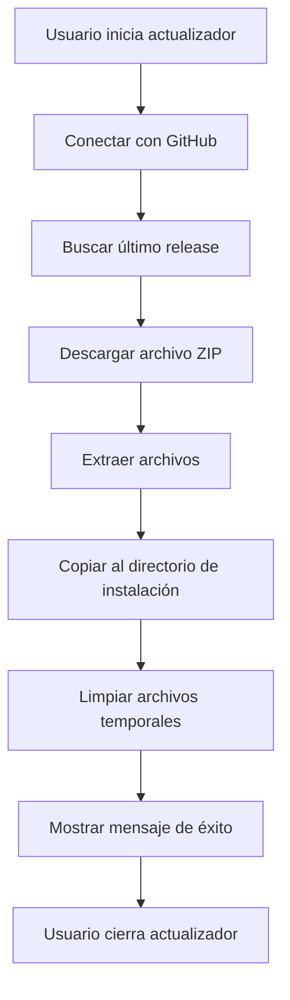

# 🚀 Retorno360 Actualizador - Resumen Completo

## ✅ Estado del Proyecto

El proyecto **Retorno360Actualizador** ha sido creado y compilado exitosamente.

### Ubicación del Proyecto
```
C:\Users\jnieto\source\repos\Retorno360Tacna\Retorno360Actualizador\
```

### Ubicación del Ejecutable Publicado
```
C:\Users\jnieto\source\repos\Retorno360Tacna\Retorno360Actualizador\publish\Retorno360Actualizador.exe
```

## 📋 Características Implementadas

### ✓ Conexión con GitHub
- Usa la API de GitHub a través de Octokit
- Se conecta al repositorio: `Javier-Nieto23/Retorno360Tacna`
- Busca el último release publicado

### ✓ Descarga Automática
- Descarga el archivo ZIP del último release
- Muestra progreso en tiempo real (MB descargados)
- Barra de progreso visual (0-100%)

### ✓ Instalación Automática
- Extrae archivos en directorio temporal
- Copia archivos al directorio del ejecutable
- Sobrescribe archivos existentes
- No sobrescribe el propio actualizador

### ✓ Interfaz Gráfica
- Ventana limpia y profesional
- Colores corporativos de Retorno 360
- Mensajes de estado claros
- Barra de progreso animada
- Botón "Finalizar" al completar

## 📦 Archivos Generados

```
Retorno360Actualizador/
├── FrmActualizador.cs              (Lógica del formulario)
├── FrmActualizador.Designer.cs     (Diseño del formulario)
├── Program.cs                       (Punto de entrada)
├── Retorno360Actualizador.csproj   (Configuración del proyecto)
├── README.md                        (Documentación completa)
├── INTEGRACION.md                   (Guía de integración)
├── publish.ps1                      (Script de publicación)
└── publish/                         (Carpeta con el ejecutable)
    ├── Retorno360Actualizador.exe
    ├── Retorno360Actualizador.dll
    ├── Octokit.dll
    └── (otras dependencias)
```

## 🎯 Flujo de Actualización



## 📝 Pasos para Crear un Release en GitHub

### 1. Preparar archivos
```bash
dotnet publish "C:\Users\jnieto\source\repos\Retorno360Tacna\Retorno360Tacna\Retorno360Tacna.csproj" -c Release -o "./release"
```

### 2. Crear ZIP
Comprime la carpeta `release` en un archivo ZIP (ej: `Retorno360-v1.0.0.zip`)

### 3. Subir a GitHub
1. Ve a: https://github.com/Javier-Nieto23/Retorno360Tacna/releases
2. Click en "Create a new release"
3. Tag: `v1.0.0` (incrementar según versión)
4. Título: `Versión 1.0.0`
5. Descripción: Changelog de cambios
6. **IMPORTANTE**: Arrastra el archivo ZIP a "Attach binaries"
7. Marcar como "Latest release"
8. Click en "Publish release"

## 🔧 Integración con la Aplicación Principal

### Opción Recomendada: Botón en MainMenu

Agrega este código en `MainMenu.cs`:

```csharp
private void btnActualizar_Click(object sender, EventArgs e)
{
    DialogResult resultado = MessageBox.Show(
        "¿Desea buscar actualizaciones?\n\nLa aplicación se cerrará.",
        "Buscar Actualizaciones",
        MessageBoxButtons.YesNo,
        MessageBoxIcon.Question
    );

    if (resultado == DialogResult.Yes)
    {
        try
        {
            string directorioActual = Path.GetDirectoryName(
                Assembly.GetExecutingAssembly().Location
            ) ?? string.Empty;

            string rutaActualizador = Path.Combine(
                directorioActual, 
                "Retorno360Actualizador.exe"
            );

            if (File.Exists(rutaActualizador))
            {
                Process.Start(rutaActualizador);
                Application.Exit();
            }
            else
            {
                MessageBox.Show("No se encontró el actualizador.", 
                    "Error", MessageBoxButtons.OK, MessageBoxIcon.Error);
            }
        }
        catch (Exception ex)
        {
            MessageBox.Show($"Error: {ex.Message}", 
                "Error", MessageBoxButtons.OK, MessageBoxIcon.Error);
        }
    }
}
```

## 📂 Estructura de Distribución

Cuando distribuyas tu aplicación, incluye ambos ejecutables en la misma carpeta:

```
Retorno360/
├── Retorno360Tacna.exe           ← Aplicación principal
├── Retorno360Actualizador.exe    ← Actualizador
├── Octokit.dll                   ← Requerido por actualizador
├── Microsoft.Data.SqlClient.dll
├── QuestPDF.dll
├── SkiaSharp.dll
└── (otras DLLs)
```

## ⚙️ Configuración del Repositorio

El actualizador está configurado para:
- **Owner**: `Javier-Nieto23`
- **Repositorio**: `Retorno360Tacna`
- **API**: GitHub REST API v3 (Octokit)

Si necesitas cambiar el repositorio, edita estas líneas en `FrmActualizador.cs`:

```csharp
private readonly string owner = "Javier-Nieto23";
private readonly string repo = "Retorno360Tacna";
```

## 🚨 Notas Importantes

### ✓ Correcto
- Cerrar completamente la aplicación antes de actualizar
- Tener conexión a Internet activa
- El release debe tener un archivo .zip
- El repositorio debe ser público (o configurar token de acceso)

### ✗ Evitar
- No ejecutar mientras la aplicación principal está abierta
- No mover el actualizador a otra carpeta
- No renombrar el ejecutable del actualizador
- No olvidar incluir Octokit.dll en la distribución

## 🔍 Troubleshooting

### "No se encontraron versiones disponibles"
**Causa**: No hay releases en GitHub  
**Solución**: Crear al menos un release con un archivo ZIP

### "No se encontró archivo ZIP"
**Causa**: El release no tiene un archivo .zip adjunto  
**Solución**: Subir un archivo .zip en la sección Assets del release

### "Error de conexión"
**Causa**: No hay conexión a Internet o GitHub está inaccesible  
**Solución**: Verificar conexión y acceso a https://github.com

### "No se pudo copiar algunos archivos"
**Causa**: Archivos en uso por la aplicación principal  
**Solución**: Asegurarse de cerrar completamente la aplicación antes de actualizar

## 📊 Próximos Pasos Recomendados

1. **Prueba Local**: Crear un release de prueba en GitHub
2. **Integrar en MainMenu**: Agregar botón "Buscar Actualización"
3. **Distribuir**: Incluir el actualizador en tu paquete de instalación
4. **Documentar**: Informar a usuarios sobre la función de actualización
5. **Versionado**: Implementar comparación de versiones automática

## 📞 Soporte

Para más información, consulta:
- `README.md` - Documentación completa del actualizador
- `INTEGRACION.md` - Guía detallada de integración
- `publish.ps1` - Script de publicación automatizado

---

**Versión**: 1.0.0  
**Fecha**: Mayo 2026  
**Framework**: .NET 10  
**Tecnologías**: WinForms, Octokit, GitHub API
